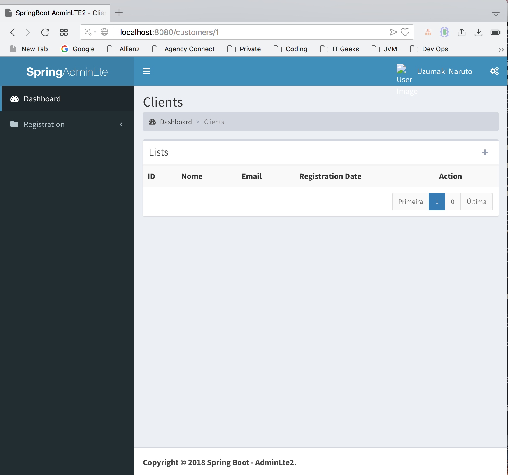

# SpringBoot with AdminLTE 2
---

Application with SpringBoot and the AdminLTE 2 template to facilitate development.

This project is forked from hendisantika/spring-boot-adminlte.git and modified local usage.

Deployment Instructions
---
This jar is marked as executable true.

- Copy it to remote server (Linux)
- Create a file called /etc/systemd/system/hbp.service with following contents:
```
[Unit]
Description=ROT13 demo service
After=network.target
StartLimitIntervalSec=0
[Service]
Type=simple
Restart=always
RestartSec=1
User=centos
ExecStart=/{path-to-app}/app.jar

[Install]
WantedBy=multi-user.target
```
- Start the Service `sudo systemctl start hbp`
- Automatically get it to start on boot `sudo systemctl enable hbp`


You will need to:
- Replace `{path-to-app}` and go with actual path of jar
- set your actual username after `User=`
- Change file name `hbp` to use actual name for systemctl service you want.

This will run your application on port 8080.

#### Reverse Proxy
Now you need reverse proxy to expose port 80 and hide actual implementation.

- Use nginx for reverse proxy (sudo apt-get install nginx)
- Create nginx configuration at `/etc/nginx/sites-available/hbp`
```
server {
       	listen 80;
       	listen [::]:80;

	access_log /apps/logs/reverse-access.log;
        error_log /apps/logs/reverse-error.log;
       	#server_name example.com;

       	location / {
         	proxy_pass http://localhost:8080/;
             	proxy_set_header X-Forwarded-For $proxy_add_x_forwarded_for;
             	proxy_set_header X-Forwarded-Proto $scheme;
             	proxy_set_header X-Forwarded-Port $server_port;
        }
}
```
- Add Configuration to Nginx (`sudo ln -s /etc/nginx/sites-available/hbp /etc/nginx/sites-enabled/hbp`)
- Verify nginx (`sudo nginx -t`)
- Reload nginx (`sudo service nginx reload`)

#### Reference: 
- `https://medium.com/@benmorel/creating-a-linux-service-with-systemd-611b5c8b91d6`

characteristics
---

* Spring Boot;
* Spring Security for basic login with permissions;
* Thymeleaf para view;
* Mysql Bank or others;
* Basic customer crud;
* Basic department crud;
* Security with roles;
* Many to many relationship via controller;
* Added error handling page;

TODO
---

* Search in the listing;
* Active Highlight in UI Side Bar w.r.t URL
* Base/Default User information should be kept in liquibase instead of if block
* Model of Dialog;
* Template for sending e-mail with template;
* Install frontend dependencies/libraries via bower/npm or some package manager;


It is free to make changes and implementations and make the code more evolved.

| #   | Username | Password |
| --- |:--------:| --------:|
| 1   | admin    | admin    |
| 2   | user     | user     |

## Screenshot

Login Pages


Dashboard Page


List Page




